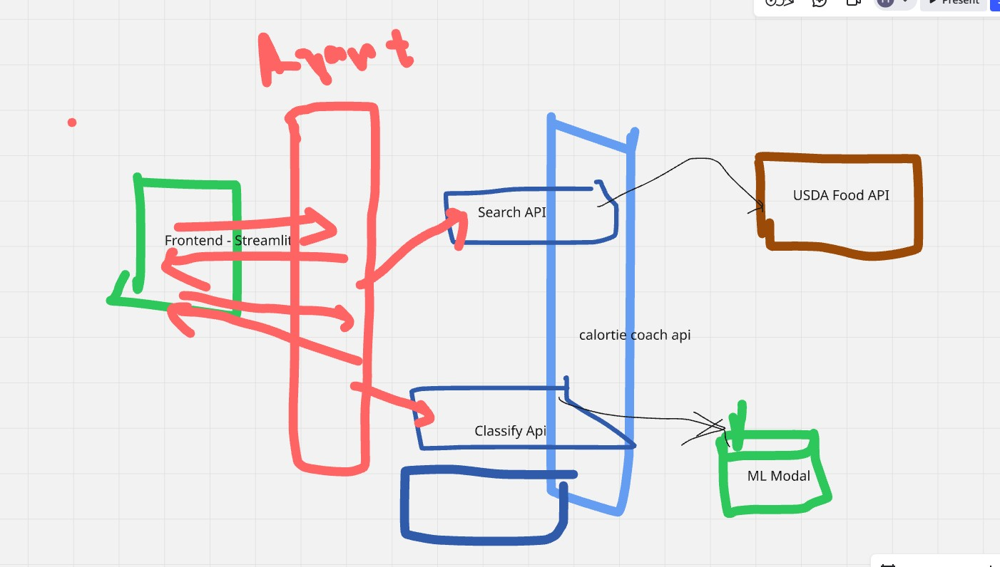

# CalorieCoach 🍎📊

A comprehensive AI-powered food classification and nutrition analysis application that combines computer vision, machine learning, and nutritional data to provide detailed food insights.

## 📋 Table of Contents

- [Overview](#overview)
- [Architecture](#architecture)
- [Features](#features)
- [Project Structure](#project-structure)
- [Installation](#installation)
- [Usage](#usage)
- [API Documentation](#api-documentation)
- [MCP Server Testing](#mcp-server-testing)
- [Model Information](#model-information)
- [Contributing](#contributing)

## 🎯 Overview

CalorieCoach is an intelligent food analysis system that:
- **Classifies food images** using a trained EfficientNet V2 model
- **Provides detailed nutritional information** via USDA FoodData Central API
- **Offers multiple interfaces** including FastAPI REST API, Streamlit web app, and MCP server
- **Supports 35 food categories** including both international and Indian cuisine
- **Integrates with LLMs** through Model Context Protocol (MCP) server

## 🏗️ Architecture



The application follows a modular architecture with the following components:

### Core Components

1. **Backend API Server** (`backend/app.py`)
   - FastAPI-based REST API with automatic OpenAPI documentation
   - Food image classification using PyTorch EfficientNet V2
   - USDA FoodData Central API integration
   - Nutritional data retrieval and processing
   - CORS-enabled for frontend integration

2. **Frontend Application** (`frontend/app.py`)
   - Streamlit-based web interface for food classification
   - Mobile-responsive design
   - Real-time image upload and classification
   - Nutritional information display
   - Interactive user experience

3. **MCP Server** (`mcp_server/mcp_server.py`)
   - Model Context Protocol server for LLM integration
   - Provides tools for food search, classification, and nutritional analysis
   - Enables AI agents to access food data programmatically
   - Supports async operations for better performance

4. **Food Tools Helper** (`tools/food_tools.py`)
   - Comprehensive wrapper for all MCP server functionality
   - OpenAI integration for intelligent food analysis
   - Batch processing capabilities
   - Both basic and AI-powered analysis options

5. **Machine Learning Pipeline** (`ml/`)
   - Jupyter notebook for model training and testing
   - EfficientNet V2 model for food classification
   - Support for 35 food categories

## ✨ Features

### 🔍 Food Classification
- **35 Food Categories**: apple_pie, baked_potato, burger, butter_naan, chai, chapati, cheesecake, chicken_curry, chole_bhature, crispy_chicken, dal_makhani, dhokla, donut, fried_rice, fries, hot_dog, ice_cream, idli, jalebi, kaathi_rolls, kadai_paneer, kulfi, masala_dosa, momos, omelette, paani_puri, pakode, pav_bhaji, pizza, samosa, sandwich, sushi, taco, taquito
- **High Accuracy**: EfficientNet V2 pre-trained model
- **Real-time Processing**: Fast image classification with confidence scores

### 📊 Nutritional Analysis
- **Comprehensive Data**: Calories, proteins, fats, carbohydrates, vitamins, minerals
- **USDA Integration**: Access to extensive USDA FoodData Central database
- **Detailed Breakdowns**: Macro and micronutrient information
- **Multiple Analysis Options**: Basic summaries and AI-powered comprehensive analysis

### 🤖 AI Integration
- **MCP Protocol**: LLM-friendly API for AI agents and chatbots
- **OpenAI Integration**: GPT-powered nutritional analysis
- **Tool-based Architecture**: Modular functions for different analysis needs
- **Batch Processing**: Analyze multiple foods simultaneously

### 🌐 API Features
- **FastAPI**: Modern, fast API with automatic documentation
- **OpenAPI Documentation**: Interactive API documentation at `/docs`
- **Health Monitoring**: System health check endpoints
- **Error Handling**: Comprehensive error responses with detailed messages
- **File Upload Support**: Direct image upload for classification

## 📁 Project Structure

```
CalorieCoach/
├── backend/
│   └── app.py                    # FastAPI server with food classification & USDA integration
├── frontend/
│   └── app.py                    # Streamlit web interface
├── mcp_server/
│   ├── mcp_server.py             # Model Context Protocol server
│   └── mcp_config.json           # MCP configuration
├── ml/
│   └── UFA_Calorie_Coach_Testing.ipynb  # Model training/testing notebook
├── models/
│   └── model_efficientnet_v2_m_1.pth    # Trained EfficientNet V2 model
├── tools/
│   └── food_tools.py             # Complete MCP wrapper with OpenAI integration
├── data/
│   ├── Train/                    # Training dataset (35 food categories)
│   ├── Valid/                    # Validation dataset
│   └── Test/                     # Test dataset
├── zipfile/
│   └── food_classification_dataset_V21.zip  # Complete dataset archive
├── requirements.txt              # Python dependencies
├── test.md                       # Sample nutrition output (Samosa example)
├── Request_flow.jpg              # Architecture diagram
└── README.md                     # This file
```

## 🚀 Installation

### Prerequisites
- Python 3.8+
- PyTorch with CUDA support (recommended)
- USDA FoodData Central API key
- OpenAI API key (optional, for AI-powered analysis)

### Setup Steps

1. **Clone the repository**
   ```bash
   git clone <repository-url>
   cd CalorieCoach
   ```

2. **Create virtual environment**
   ```bash
   python -m venv .venv
   # On Windows:
   .venv\Scripts\activate
   # On macOS/Linux:
   source .venv/bin/activate
   ```

3. **Install dependencies**
   ```bash
   pip install -r requirements.txt
   ```

4. **Environment Configuration**
   Create a `.env` file in the root directory:
   ```env
   USDA_API_KEY=your_usda_api_key_here
   OPENAI_API_KEY=your_openai_api_key_here
   ```

5. **Download Model**
   Ensure the trained model is placed at:
   ```
   models/model_efficientnet_v2_m_1.pth
   ```

6. **Verify Installation**
   ```bash
   python backend/app.py
   ```

## 💻 Usage

### Backend API Server

Start the FastAPI server:
```bash
cd backend
python app.py
```

The API will be available at `http://localhost:8004`

**Available Endpoints:**
- `GET /` - Redirects to API documentation
- `GET /docs` - Interactive OpenAPI documentation
- `GET /health` - Health check endpoint
- `POST /api/classify` - Food image classification
- `GET /api/search` - Search foods in USDA database

### Frontend Web Application

Start the Streamlit web interface:
```bash
cd frontend
streamlit run app.py
```

The web app will be available at `http://localhost:8501`

Features:
- **Image Upload**: Drag and drop or browse for food images
- **Real-time Classification**: Instant food recognition
- **Nutritional Details**: Comprehensive nutritional information
- **Mobile-responsive**: Works on all devices

### MCP Server

Start the MCP server for LLM integration:
```bash
cd mcp_server
python mcp_server.py
```

### Food Tools (Python Helper)

Use the comprehensive food tools helper:
```python
from tools.food_tools import food_summary, search_foods, classify_food

# Basic food analysis
result = await food_summary("samosa", use_openai=False)

# AI-powered analysis
analysis = await food_summary("samosa", use_openai=True)

# Food search
foods = await search_foods("apple")

# Image classification
classification = await classify_food("/path/to/image.jpg")
```

## 📖 API Documentation

### Food Classification

**POST** `/api/classify`

Upload an image for food classification:

```bash
curl -X POST -F "file=@path/to/food_image.jpg" http://localhost:8004/api/classify
```

**Response:**
```json
{
  "predicted_class": "samosa",
  "confidence": 95.42,
  "success": true
}
```

### Food Search

**GET** `/api/search?food_name=apple`

Search for foods in the USDA database:

**Response:**
```json
{
  "totalHits": 150,
  "currentPage": 1,
  "totalPages": 15,
  "foods": [
    {
      "fdcId": 171688,
      "description": "Apples, raw, with skin",
      "brandOwner": "",
      "ingredients": ""
    }
  ]
}
```

### Health Check

**GET** `/health`

Check system health:

**Response:**
```json
{
  "status": "ok",
  "service": "Calorie Coach FastAPI"
}
```

## 🧪 MCP Server Testing

To test the MCP server functionality, use the Model Context Protocol inspector:

```bash
npx @modelcontextprotocol/inspector python mcp_server/mcp_server.py
```
file path for classify tool is mcp_server/mcp_server.py : **.\data\Test\cheesecake\cheesecake-1291.jpg**


This will launch an interactive inspector where you can:
- **Test MCP Tools**: search_foods, get_food_details, get_multiple_foods, classify
- **Validate Responses**: Check tool outputs and error handling
- **Debug Integration**: Test LLM integration scenarios

**Available MCP Tools:**
- `search_foods(query)` - Search USDA food database
- `get_food_details(fdc_id, format)` - Get detailed food information
- `get_multiple_foods(fdc_ids, format)` - Get multiple food details
- `classify(image_path)` - Classify food images

## 🤖 Model Information

### EfficientNet V2 Medium
- **Architecture**: EfficientNet V2 Medium
- **Training Data**: 35 food categories with thousands of images per class
- **Input Size**: 224x224 RGB images
- **Output**: 35-class classification with confidence scores
- **Preprocessing**: Standard ImageNet normalization
- **Device Support**: Automatic CUDA/CPU detection

### Supported Food Categories

**International Cuisine:**
- apple_pie, baked_potato, burger, cheesecake, donut, fries, hot_dog, ice_cream, pizza, sandwich, sushi, taco, taquito

**Indian Cuisine:**
- butter_naan, chai, chapati, chicken_curry, chole_bhature, crispy_chicken, dal_makhani, dhokla, idli, jalebi, kaathi_rolls, kadai_paneer, kulfi, masala_dosa, momos, paani_puri, pakode, pav_bhaji, samosa

**Others:**
- omelette, fried_rice

### Sample Nutritional Output

See [test.md](test.md) for a complete example of nutritional analysis output for samosa, including:
- **Comprehensive Nutrients**: Calories (310 kcal), proteins, fats, carbohydrates
- **Vitamins & Minerals**: Complete vitamin profile and mineral content
- **Detailed Breakdown**: Saturated fats, dietary fiber, cholesterol, sodium
- **Additional Info**: Water content, caffeine, alcohol levels

## 🔧 Configuration

### Environment Variables

| Variable | Description | Required |
|----------|-------------|----------|
| `USDA_API_KEY` | USDA FoodData Central API key | Yes |
| `OPENAI_API_KEY` | OpenAI API key for AI-powered analysis | Optional |
| `OPENAI_TEST_MODEL` | OpenAI model to use (default: gpt-4o-mini) | Optional |

### API Configuration

- **Backend Port**: 8004 (configurable)
- **Frontend Port**: 8501 (Streamlit default)
- **Model Path**: `models/model_efficientnet_v2_m_1.pth`
- **Device**: Automatically detects CUDA/CPU

## 🤝 Contributing

1. Fork the repository
2. Create a feature branch (`git checkout -b feature/amazing-feature`)
3. Commit your changes (`git commit -m 'Add amazing feature'`)
4. Push to the branch (`git push origin feature/amazing-feature`)
5. Open a Pull Request

### Development Guidelines
- Follow PEP 8 style guidelines
- Add unit tests for new features
- Update documentation for API changes
- Test MCP server integration with the inspector tool

## 📄 License

This project is licensed under the MIT License.

## 🙏 Acknowledgments

- **USDA FoodData Central** for comprehensive nutritional data
- **PyTorch** and **torchvision** for deep learning capabilities
- **FastAPI** for modern, fast API development
- **Streamlit** for rapid web app development
- **OpenAI** for AI-powered nutritional analysis
- **EfficientNet** architecture by Google Research
- **Model Context Protocol** for LLM integration standards

## 📞 Support

For questions, issues, or contributions, please:
- Open an issue on GitHub
- Check the API documentation at `http://localhost:8004/docs`
- Review the sample outputs in [test.md](test.md)
- Test MCP integration with the inspector tool

---

**CalorieCoach** - Making nutrition analysis intelligent and accessible! 🍎✨
